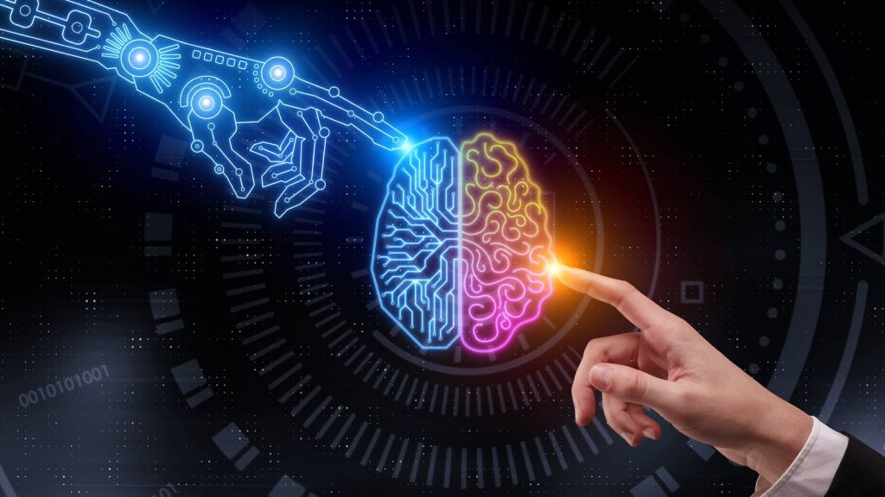

# Merge AI Models
AI 모델 병합 프로젝트를 위해 Speech to Text와 Object Detection 모델을 사용하였고,
마이크를 이용하여 Speech로 Detect된 Object의 Label을 변경하는 모델을 만들어 보았습니다...

## Configuration
~~~
* 10th generation Intel® CoreTM processor onwards
* At least 32GB RAM
* Ubuntu 22.04
* Python 3.9.13
~~~

## Clone code
~~~
git clone --recurse-submodules https://github.com/openvinotoolkit/open_model_zoo.git
~~~

## Prerequite
~~~
python -m venv openvino_env
openvino_env\Scripts\activate
pip install openvino-dev[tensorflow,onnx,pytorch,keras]
git clone --recurse-submodules https://github.com/openvinotoolkit/open_model_zoo.git
cd open_model_zoo
python -m pip install -U pip
pip install -r .\demos\requirements.txt
~~~

## Steps to build
~~~
cd open_model_zoo
openvino_env\Scripts\activate
~~~

## Steps to run
~~~
cd open_model_zoo
openvino_env\Scripts\activate
cd Speech2Text_and_ObjectDetection
python speech_and_detection.py -i 0
~~~

## Output

## Appendix
- 해당 repository 폴더 전체를 다운받으면, speech_and_detection.py 파일만으로 바로 실행이 가능하다.
- Object_detection_raw.py : Object detection만을 위한 Code
- Speech2Text_raw.py : Speech to Text만을 위한 Code
- To use one model, Additional library installations and directory paths should be noted.
